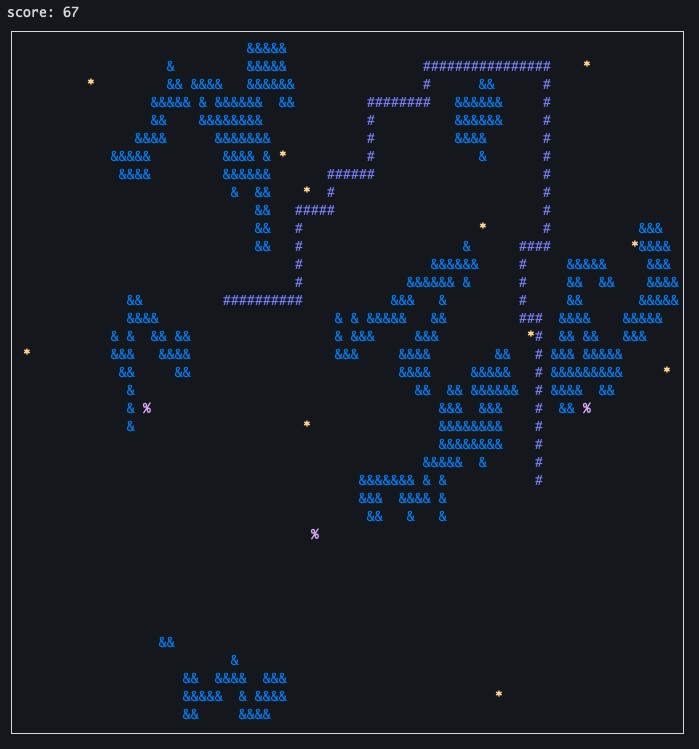
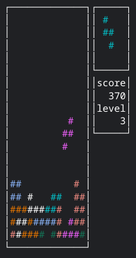

# CLI Games
This repo contains a bunch of Games that are played in the *Terminal* or *Command Prompt*. 
The code for these games is written in `python`. 
Only works on Unix-like systems as it needs [curses](https://en.wikipedia.org/wiki/Curses_(programming_library))

# Requirements
`python 3.x`
`curses`

# Snake

The well known classic game [Snake](https://en.wikipedia.org/wiki/Snake_(video_game_genre)).

## How to run
You can run the game with the command `python3 snake_game.py <username>`

## Controls
`arrow keys` navigate your **Snake** through the field. 
`p` pause the game. 
`r` restart the game. 
`q` quit the game. 

## Game Objects
`#` these are part of your **Snake**. 
`&` these are generated obstacles you must avoid. 
`*` these are foods randomly placed on the field. They increase your **Snake** length by 1. 
`%` these are super foods. They increase your **Snake** length by 5. 

Scoring is equal to the size of your **Snake**. 
If you quit or it is Game Over, your score will be written to *snake_highscores.txt* file in the root folder of this repo.

# Maze Runner

A self made game trying out the [Wave Function Collapse Algorithm](https://github.com/mxgmn/WaveFunctionCollapse) to generate an endless maze.

## How to run
You can run the game with the command `python3 maze_runner.py <username>`

## Controls
`arrow keys` navigate your character through the maze. 
`f` fire a laser, destroying enemies or walls on it's path. 
`p` pause the game. 
`r` restart the game. 
`q` quit the game. 

## Game Objects
`@` your character. 
`#` maze walls. 
`.` points to be gathered in the maze. 
`>` missiles flying through the maze, killing your character on collision. 
`%` ammo box refilling your laser gun. 

Scoring is equal to amount of points you gathered. 
If you quit or it is Game Over, your score will be written to *maze_runner_highscores.txt* file in the root folder of this repo.

# Tetris

The well known classic game [Tetris](https://en.wikipedia.org/wiki/Tetris). 

## How to run
You can run the game with the command `python3 tetris.py <username>`

## Controls
`arrow up` rotate the piece. 
`arrow down` move the piece. 
`arrow left/right` move the piece to the left/right. 
`p` pause the game. 
`r` restart the game. 
`q` quit the game. 

Scoring is according to the Original BPS scoring system: 
<table>
  <tr>
    <th>Line clear</th>
    <th>Points</th>
  </tr>
  <tr>
    <td>1 (single)</td>
    <td>4</td>
  </tr>
  <tr>
    <td>2 (double)</td>
    <td>10</td>
  </tr>
  <tr>
    <td>3 (triple)</td>
    <td>30</td>
  </tr>
  <tr>
    <td>4 (tetris)</td>
    <td>120</td>
  </tr>
</table>

If you quit or it is Game Over, your score will be written to *tetris_highscores.txt* file in the root folder of this repo.

# Hearts
The famous card game [Hearts](https://en.wikipedia.org/wiki/Hearts_(card_game)).

## How to run
You can run the game with the command `python3 hearts.py`

## Controls
`number keys` decide which card you want to play.

## Rules
The rules for this game are almost the same as normal *Hearts* except for a few additions (based on the cafe rules played in Ninove, Belgium). 
All heart cards are worth 1 point, except for the Lady which is worth 14 points. 
All the other Ladies are worth 13 points. 
If an Ace or King is played, any following player that has the Lady of that particular suit has to play it. 
If you cannot follow the suit that is on the table. You must first lay down your hearts, starting with the Lady if in hand. Once all your hearts are gone, you can lay down your Ladies if in hand.
